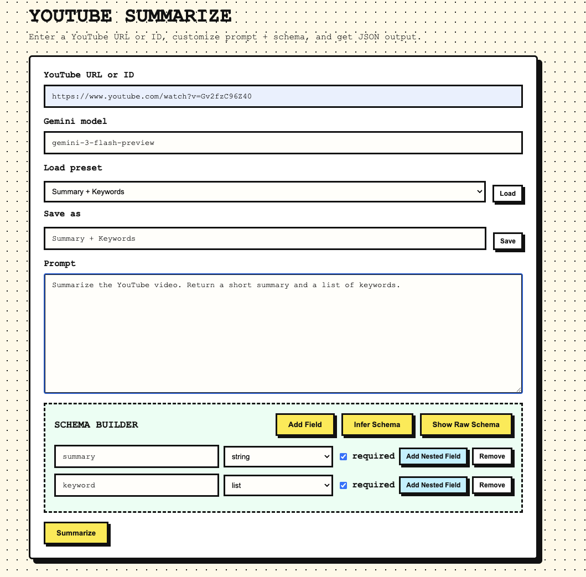
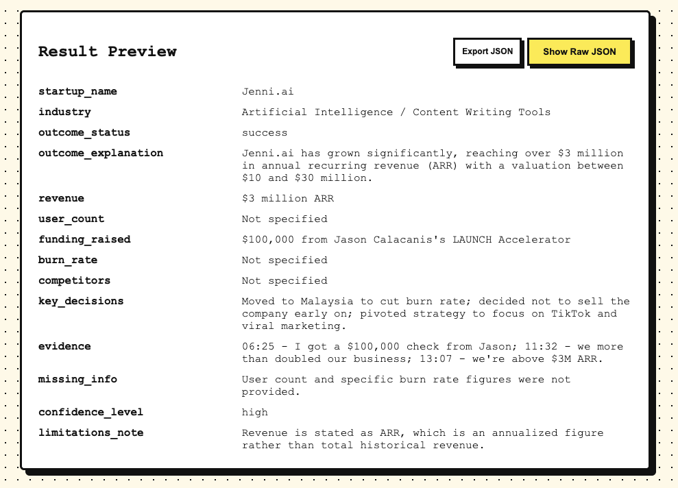

# Youtube Summarizer

Summarize YouTube videos into structured JSON with Gemini 3.0. Includes a web UI for building schemas, prompt editing,
and previewing results.




## Features

- Prompt editor + schema inference using Gemini
- JSON output preview with optional raw JSON view
- Export JSON 
- CLI 

## Environment

Use a `.env` file for API keys and secrets. Copy `.env.example` to `.env` and fill in values.

## Install

```bash
uv sync
```

## CLI (single video)

Run with `uv`:

```bash
uv run youtube-summarize "https://www.youtube.com/watch?v=VIDEO_ID" --out out/summary.json
```

## Web app (FastAPI)

Start the server:

```bash
uv run youtube-summarize-web
```

Open `http://127.0.0.1:8000` in your browser.

### Web UI overview


- Enter a YouTube URL or ID
- Edit the prompt
- Build a schema or click "Infer Schema"
- Click "Summarize" to get JSON + preview
- Click "Export JSON" to download results

## structured output

This tool summarizes the video content into a structured JSON format defined by your schema so results are consistent
and easy to parse.



## Presets (file-based)

Presets live in `data/presets` as JSON files:

```json
{
  "name": "Summary + Keywords",
  "prompt": "Summarize the YouTube video.",
  "schema": { "type": "object", "properties": { "summary": { "type": "string" } } }
}
```

Use the Presets dropdown to load or save new ones (no database required).


## API endpoints

- `POST /api/summarize` expects: `video_input`, `prompt`, `schema`, `model`
- `POST /api/infer-schema` expects: `prompt`, `model`
- `GET /api/presets` list presets
- `GET /api/presets/{id}` load preset
- `POST /api/presets` save preset (`name`, `prompt`, `schema`)
